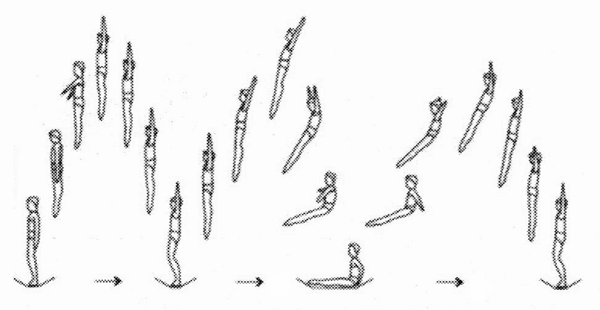
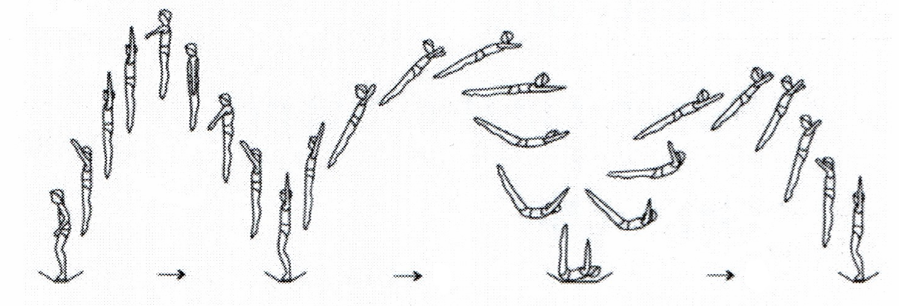

Grundsprünge und Landungsarten
==============================

Im Folgenden sollen die Grundsprünge sowie die zulässigen Landungsarten auf dem Trampolin vorgestellt werden. Zunächst wird hierfür der Strecksprung mit Armeinsatz und das Stellen der Arme erklärt. Auf dieser Basis, ist anschließend die Zeit gekommen das Repertoire zu erweitern. Die Sprünge werden hier in fünf Kategorien aufgeteilt. Zuerst die Fußsprünge Hocksprung (**Hocke**), Bücksprung (**Bücke**) und Grätschwinkelsprung (**Grätsche**). Weiter geht es mit Sprüngen in denen eine Schraubenbewegung ausgeführt wird: Standsprungschraube (**½ Schraube**, **ganze Schraube**). Danach folgen die drei weiteren Landungsarten, die möglich sind: Sitzlandung, Rückenlandung und Bauchlandung (aka. **Sitz**, **Rücken**, **Bauch**). Im Folgekapitel :doc:`sprungverbindung` geht es um die Verbindungen der Landungsarten mit Schrauben wie z.B. **½ Schraube zum Sitz**. Für die Benennung werden anstatt der langen formalen Namen, wie im Training, die Trivialnamen verwendet.

Nach einer kurzen **Bewegungsbeschreibung** erfolgt je Sprung eine Übersicht über die **Leistungsvoraussetzung** und die Schritte, die ein **methodisches Erlernen** des Sprunges ermöglichen. Normalerweise sollte die Reihenfolge der Schritte eingehalten werden. Es ist jedoch möglich und sinnvoll, einzelne Schritte, je nach Können und Lernfortschritt des Aktiven, auszulassen. Zusätzlich werden für die Sprünge häufige **Fehler und Korrekturen** angeboten.

Falls der Sport vom Aktiven länger betrieben werden will, ist es wichtig von Beginn an auf Fehler in der Ausführung einzugehen, da sich Bewegungen relativ schnell im Kopf verfestigen. Bei der Korrektur am Gerät sollte man sich entscheiden auf die Hauptfehler einzugehen und  **Fehler chronologisch abzuarbeiten**, beginnend beim Absprung, da viele Ausgleichsbewegungen oft nur Folgefehler sind.

.. note::
    Um einen Bewegungsablauf gezielt zu reproduzieren, benötigt man bei neu Erlerntem ca. 7 Wiederholungen der korrekten Bewegung. Im Gegensatz dazu werden ca. 35 Wiederholungen benötigt, um einen Bewegungsablauf umzulernen. Bei diesen Kennzahlen handelt es sich um gemittelte Erfahrungswerte, die individuell stark abweichen können.

Ausführungsformen
------------------

Zur Abmilderung der Anforderung während des Erlernens lassen sich Sprünge hinsichtlich der Komplexität und Qualität methodisch abstufen nach grober Ausführung, fein- und Feinstform. Die **grobe Ausführung** deutet Bewegungen mindestens (erkennbar) an und lässt die Arme unbeachtet. Diese können entweder gestellt oder am Körper angelegt bleiben. Am Beispiel des Hocksprungs werden demnach nur die Beine leicht angehockt und der Oberkörper zum Ausgleich vorgelagert. Bei der **Feinform** gibt es einen vereinfachten Armeinsatz. Ausgehend von den gestellten oder angelegten Armen tippen die Hände im Beispiel der Hocke kurz die Knie an und gehen danach zurück in ihre Ausgangsposition. Die **Feinstform** hat vollen Arm- und Körpereinsatz und erfordert eine gewisse Sprunghöhe, Geschwindigkeit und Übung. Ziel sollte immer die Feinstform sein.

..
    TODO bilder der phasen finden

.. _Armeinsatz:

Strecksprung mit Armeinsatz
---------------------------

Die Arme unterstützen alle Bewegungen auf dem Trampolin und sorgen mit kleinen Korrekturen für das Gleichgewicht. Sie ermöglichen insbesondere bei komplizierteren Bewegungen einen betont nach oben gerichteten Absprung und richten den Oberkörper auf. Aus diesem Grund sollte der Armeinsatz, bzw. der Strecksprung, ausgiebig geübt und immer wieder verbessert und korrigiert werden - und das nicht nur in den ersten Trainingsstunden. Besonders in der Anfangszeit sollte den Aktiven verdeutlicht werden, dass die Sprunghöhe hauptsächlich durch Abdruck der Fußballen vom Tuch und zusätzlich durch den Armschwung zustande kommt.

Bewegungsbeschreibung
~~~~~~~~~~~~~~~~~~~~~

- aufrecht stehend im Tuch - Ausgangslage sind am Körper angelegte Arme, Hände seitlich vorne auf dem Oberschenkel ruhend
- die Arme werden über die Vorderseite gestreckt nach oben neben den Kopf geführt - eine kraftvolle beschleunigende Bewegung bis ca 10° vor der Vertikalen. Danach langsames Aufziehen bis zur Hochhalte.

  - alternativ ist ein Armzug über die Seite möglich - gerade bei fehlender Kontrolle über die Mittelkörperspannung kann diese Bewegung leichter sein
  - in Vereinen sieht man oft eine reduzierte Bewegung mit Ähnlichkeit zum Brustschwimmen bei der die Arme im gebeugten Zustand dicht vorm Körper nach Oben geführt werden - krumme Arme bedeuten im Wettkampf i.d.R. Punktabzug
  - die Intensität des Armschwungs ermöglicht einen Wechsel zwischen Höhe gewinnen und halten

- die gestreckten Arme bleiben oben für einen kurzen Moment gestellt, bzw. können sie noch etwas weiter aufgezogen werden - zeitlich etwa bis zum höchsten Punkt des Sprungs
- anschließend werden die Arme seitlich am Körper heruntergeführt - dies kann langsam erfolgen - Vollendung spätestens bei der Landung
- Arme sorgen trotz der Bewegung für Gleichgewicht mittels kleiner Auslenkungen

.. caution::
    Die Arme sollten sich besonders beim Herunterführen weiterhin im Sichtfeld befinden - zum einen um eine Rücklage zu verhindern und zum anderen, da sich Arme im Falle eines Sturzes nicht hinter dem Aktiven befinden sollten

Fehler und Korrekturen
~~~~~~~~~~~~~~~~~~~~~~~

- Landung mit Rücklage: Armschwung nach oben zu weit? Spannungsverlust im Absprung? Beides kann sich durch ein Hohlkreuz zeigen. -> Armzug besser dosieren, alternativ Arme über Seite ziehen, bzw. Sprunghöhe reduzieren
- Wandern und Armrudern: Trockenübung Armeinsatz, bzw. Höhe reduzieren
- Beine arbeiten mit oder Knie sind krumm: erklären, dass Beine nicht zum Höhengewinn oder zum Halten des Gleichgewichts benutzt werden. Durchgängig (annähernd) gestreckte Knie während des Strecksprungs!
- Arme hinter dem Körper: Bewegung erneut erklären oder Arme erstmal statisch halten

Stellen der Arme
-----------------

Grundsätzlich gilt beim Trampolinturnen, dass sich die Arme vor einem Aktionssprung aus dem Stand in Hochhalte befinden. In der Trampolin-Sprache sind die **„Arme gestellt“**. Das erfordert neben einer gewissen Beweglichkeit des Schulterbereichs auch Kraft, gerade bei den Jüngeren. Diese Eigenschaften können und sollen bereits bei der Gymnastik vorbereitet werden. Aber auch auf dem Trampolin selbst gibt es einige Übungen für den Armeinsatz.

.. TODO: Arme nicht nur neben dem Kopf, sondern Schultergürtel aktivieren und "ohren einklemmen"

Methodische Übungsreihe
~~~~~~~~~~~~~~~~~~~~~~~

- **Demonstration** als Trockenübung, zusätzlich langsam um den eigentlichen Bewegungsablauf deutlich zu machen
- Sprünge (auf Kommando) auf einer Turnmatte. Die Sprünge erfolgen aus einer leichten Hock-Position heraus.
- Prellsprünge (reaktiv mit dem Fußballen abdrücken) auf einem Weichboden mit gestellten Armen
- Strecksprünge. Hierbei werden die Arme konsequent die ganze Zeit durchgedrückt aus den Schultern heraus zur Decke gestreckt. Jeweils im Wechsel dazu Strecksprünge, bei denen die Arme gestreckt eng am Körper angelegt werden.
- Variation A: 10 x oben - 10 x unten, 3 x unten - 3 x oben
- Variation B: kleine (Plastik-) Flaschen oder Keulen in den Händen halten
- unterstützte Handstände, mit seitlich haltender Person oder mit Bauch zur Wand
- Bewegungsablauf „Arme stellen“ vor einem Sprung, Vorschlag

  - „und“ Arme sind gestreckt am Körper angelegt
  - „eins“ Arme gestreckt zur Decke ziehen
  - „zwei“ Arme wieder gestreckt am Körper angelegt
  - „drei“ Absprung mit gestreckt zur Decke gestellten Armen
  - alternativ können die Arme erst im dritten Absprung gestellt sein (manchen Neulingen hilft ein früheres Stellen bei zwei)

- Die Arme müssen jeweils schon kurz vor der Landung in die gewünschte Position gebracht werden. Auf kontrollierte und ruhige (Arm-) Bewegungen achten

.. tip::

    Bei fehlender Schulterbeweglichkeit bzw. Haltekraft, kann es helfen die Handflächen beim Stellen der Arme nach außen zu drehen. Ebenso kann ein sehr spätes und schnelles Stellen (fast im Moment der Landung) helfen.

    Aufrechtes Abspringen lässt sich unterstützen, indem der Aktive sich nach "drei" mit gestellten Armen vornimmt Höhe zu gewinnen. Dies gibt in dem kritischen Moment des Absprungs extra Körperspannung und wird besonders bei Saltorotationen wichtig um ein Wandern auf dem Tuch zu verhindern.

Blickrichtung
-------------

Ein früher Fokus auf die Kopfhaltung kann späteres zeitaufwendiges Umlernen verhindern. Manche Aktive neigen dazu nicht nur mit gesenktem Kopf, sondern auch leicht vorgebeugt aufs Tuch zu schauen um ihre Landung zu überwachen. Diese Vorlage erzeugt eine Wanderbewegung auf dem Tuch und verhindert meist ein korrektes Stellen der Arme. Gleichzeitig kann es passieren, dass die Wanderbewegung mit einem Herausstrecken des Gesäßes kompensiert wird.

Sprungtechnisch optimal ist ein ruhiger Blick geradeaus zur Wand bzw. eine neutrale Kopfhaltung. Im Bestfall findet man einen Fixpunkt. Das Tuch kann weiterhin im peripheren Sichtfeld wahrgenommen werden. Falls der Aktive plant an Wettkämpfen teilzunehmen gibt es die Empfehlung den **Blickpunkt ans Ende des Trampolins** bzw. die vordere Mattenkante zu legen. So spart man sich die Eingewöhnung in einer neuen Halle.

Hock-, Grätschwinkel- & Bücksprung
-------------------------------------

Bei allen Landungen auf den Füßen können die Beine im Tuch etwa schulterweit geöffnet sein, um eine bessere Standfähigkeit zu ermöglichen. Der Abdruck aus dem Tuch erfolgt hauptsächlich mit den Fußballen, mit Unterstützung der Arme. Die Arme sind beim Absprung grundsätzlich **gestellt**. Direkt nach dem Absprung werden die **Beine geschlossen**. Alle Fußsprünge beginnen mit einem gestreckten Sprung in die Höhe - mit eventuell variierender Absprungposition zur Sprungvorbereitung. Die eigentliche Hauptbewegung wird erst **nach dem Absprung** ausgeführt, wenn die Füße das Trampolin verlassen haben. Das ermöglicht ein Springen auf der Stelle. Die Füße und Zehen sind in der Luft möglichst getreckt ("pointy toes"). Mit Ausnahme von Sprüngen mit Hocken sind die Knie ebenfalls immer gestreckt in der Luft.

.. figure:: ../media/spruenge_hocke_buecke_graetsche.png
    :width: 800px
    :name: fig:hock_buck_gratsch
    :alt: Die drei Basissprünge in Phasendarstellung

    Die drei Fusssprünge in Phasendarstellung

.. TODO: hocke und grätsche sind rückwärts dargestellt?!?
.. TODO: grätsche und bücke auch einzeln komplett auflisten

Bewegungsbeschreibung
~~~~~~~~~~~~~~~~~~~~~

- Bei der **Hocke** werden die Beine gehockt nach vorne zum Oberkörper geführt. Die Hände fassen dabei die Knie knapp unterhalb der Kniescheibe an. Der Oberkörper ist leicht nach vorne gebeugt.
- Bei der **Bücke** werden die Beine gestreckt nach oben in die Waagerechte geführt. Die Hände fassen hierbei von oben auf den Fußspann. Alternativ kann der Fuß oder Knöchel gegriffen werden. Der Oberkörper befindet sich möglichst nahe an den Oberschenkeln. Gefordert ist ein Winkel von deutlich weniger als 90 Grad zwischen Oberkörper und Oberschenkel.
- Die **Grätsche** verläuft wie die Bücke. Bloß werden hierbei die gestreckten Beine in der Luft mindestens 90 Grad weit gespreizt.
- Die Landung erfolgt jeweils mit gestellten Armen.

Hocksprung
~~~~~~~~~~~

- Absprung, Arme starten in gestellter Haltung
- **In der Steigphase wird die Hocke eingeleitet**, Beine sind bereits geschlossen, Knie bleiben parallel zueinander
- Hände bewegen sich zur Hocke und greifen den Unterschenkel, bzw. das Scheinbein dicht unter den Knien, und können die Hocke zusätzlich komprimieren
- Die Hock-Position ist kompakt, Knie berühren die Brust, Beine sind geschlossen
- **In der Phase des Fallens**, bzw. nach kurzem stabilem Halten, **wird die Hock-Position explosiv aufgelöst**
- beim Auflösen der Hocke bewegen sich die Arme mit den Beinen, bzw. unterstützen sie die Öffnung
- nach der Öffnung liegen die Arme eng am Körper, Hände leicht seitlich auf dem Oberschenkel
- kurz vor dem Tuchkontakt bewegen sich die Arme wieder in die gestellte Haltung

Fehler und Korrekturen
~~~~~~~~~~~~~~~~~~~~~~~

- Anfersen statt Anhocken (Hocke): Knie bewegen sich zum Bauch (und andersrum)
- Beine / Knie auseinander (Hocke, Bücke): Schaumstoff oder Tuch zwischen die Knie, bzw Umfassen der Unterschenkel üben
- Umfallen oder Wandern nach dem Sprung: Aktion erst später nach Absprung ansetzen, Fixpunkt suchen, Oberkörper aufrichten vor Landung
- Knie krumm oder Beine nicht 90° gegrätscht (Grätsche, Bücke): Beweglichkeit verbessern, Trockenübung aus Rückenlage,

Diese Sprünge lassen sich normalerweise von Anfängern ohne große Hilfe erlernen. Als "Vorübung" können die Teilnehmenden die Bewegung anfangs nur andeuten und innerhalb weniger Wiederholungen intensivieren bis zum vollen Sprung. Es sollte darauf geachtet werden, dass die Landung möglichst aufrecht und nicht mit Vor- oder Rücklage erfolgt. Ein Indikator für den Trainer ist eine starke Asymmetrie während der Ausführung des Sprungs (z.B. Oberkörper bleibt aufrecht). Eventuell sollte die Landung durch den Trainer auf dem Tuch zu Beginn unterstützt werden.

.. tip::
    Hocke und Grätsche sind leichter erlernbar und für den Anfang ausreichend. Das Erlernen der Bücke kann zu einem späteren Zeitpunkt - beispielsweise nach dem Rückensprung - erfolgen.

.. _Schrauben:

Schraubensprünge
-----------------

Schrauben haben beim Trampolinturnen eine nicht unwesentliche Bedeutung. Erlauben sie doch, besonders später in Verbindung mit den Salti, eine viele größere Variation der Sprünge (Salto vw., Salto vw. mit ½-Schraube, Salto vw. mit 1½-Schrauben ...) auf dem Trampolin.

Es gibt verschiedene Techniken eine Schraubenbewegungen in der Luft auszuführen. Die erste ist recht intuitiv, aber höhenabhängig und damit nicht einfach genau dosiert ausführbar. Die Schraubenbewegung wird hier schon im Tuch durch ein Drehen des Körpers in die gewünschte Richtung eingeleitet. Das Tuch bzw. die Füße sorgen demnach für die Rotation. Die zweite und bevorzugte Technik funktioniert indem man zur Einleitung der der Rotation die Schulter-Seite entsprechend der gewünschten Drehrichtung impulsiv nach hinten aushebt und die Gegenseite nach vorne kippt. Der Kopf folgt der Bewegung und bleibt stabil neutral zur Schulter. Für Schraubensalti kommt in Erweiterung zur beschriebenen Schulterbewegung die **asymmetrische Armbewegung**, welche den Impuls noch verstärkt.

.. TODO: bewegungsbeschreibung in fließtext unten nochmal

Ski- und Wasserspringer verwenden noch weitere Schraubentechniken. Skispringer schrauben etwa mit Einsatz des gesamten Oberkörpers. Dies findet beim Trampolinturnen keine Verwendung. Die Wasserspringer führen eine **Hula-Hoop-Bewegung** in der Luft aus - zusätzlich kann eine Scherenbewegung der Beine weitere Rotation erzeugen. Als aufmerksamer Trampolintrainer entdeckt man die Hula-Hoop-Bewegung unter Umständen bei Sitz ½-Schraube Sitz oder bei Baranis häufig als Fehlerbild.

Beim Trampolinturnen sollte prinzipiell **eine Drehrichtung** vom Aktiven **eingehalten** werden. In welche Richtung der Turner sich dreht, ist egal; empfehlenswert ist, dass er eine einmal „ausgesuchte“ Drehrichtung bei allen später gelernten Schraubensprüngen beibehält. Zur Förderung der koordinativen Fähigkeiten können Standsprungschrauben bis ca, 540° in beide Richtungen geübt werden. Bei Demonstrationen sollte man gerade bei kleinen Kindern darauf achten, deren eigene Drehrichtung zu verwenden, um nicht durch einen „Nachmach-Effekt“ eine falsche Drehrichtung des Aktiven zu bewirken.

.. figure:: ../media/sprung_halbe_schraube.jpg
    :width: 200px
    :name: fig:halbe_schraube
    :alt: Halbe Schraube in Phasendarstellung

    Halbe Schraube in Phasendarstellung

Fußsprungschraube aus dem Tuch
-------------------------------

Bei den Sprüngen des Anfängerbereichs handelt es sich meist um **im Tuch eingeleitete Schraubenbewegungen**.

Übung: Standsprungschraube mit zur Seite gehaltenen Armen springen, in der Luft die Arme an den Körper heranziehen: die Schraube wird schneller
- erst auf genügendes Steigen aus dem Tuch achten; eventuelle Saltorotationen werden ebenfalls noch vor der Schraubenbewegung eingeleitet

Bewegungsbeschreibung
~~~~~~~~~~~~~~~~~~~~~

- beim Absprung zum Strecksprung erfolgt eine Einleitung der Schraube mit den Füßen durch seitlichen Abdruck vom Tuch
- eingeleitete Schrauben müssen so dosiert sein, dass im höchsten Punkt des Sprungs die Hälfte der gewünschten Schraubenmenge erreicht ist, somit muss die Schraube für jede Sprunghöhe anders dosiert, bzw. neu gelernt, werden
- je mehr der Körper gestreckt ist, desto schneller erfolgt die Schraubendrehung
- Arme nahe der Rotationsachse, im Bestfall die Körpermitte, beschleunigen die Schraubendrehung
- Vorsicht! Je mehr Schraubenimpuls beim Absprung mitgegeben wird, desto mehr ist davon bei der Landung im Tuch noch vorhanden; Der Aktive sollte Spannung halten und die Beine zusammendrücken, damit sich die Knie nicht verdrehen.

Methodische Übungsreihe
~~~~~~~~~~~~~~~~~~~~~~~~

- Sprung mit seitlich ausgestreckten Armen (T-Form), halbe Schrauben vor und zurück
- sobald das stabil funktioniert, nach einer viertel Schraube die Arme impulsiv an die Brust nehmen und damit die Schraube beschleunigen, zum Verlangsamen btw. beim Abstoppen die Arme wieder ausstrecken
- die Aktiven können bereits hier mit dem Einfluss der Schulter experimentieren, indem der vorauseilende Arm in direkter Bewegung und der nacheilende Arm in einem Bogen in Schraubrichtung angezogen wird
- Übung mit gestellten Armen wiederholen - die Schraube ist bei gleichem Krafteinsatz direkt schneller und kann nur verlangsamt werden

Fußsprungschraube mit Schultereinsatz
--------------------------------------

Bewegungsbeschreibung
~~~~~~~~~~~~~~~~~~~~~~

- Absprung zum Strecksprung
- eine Schulter-Seite wird entsprechend der Drehrichtung schnellkräftig nach hinten ausgehoben, die andere Schulter kann nach vorne bewegt und impulsiv abgebremst werden
- der Kopf folgt der Bewegung in Drehrichtung und bleibt stabil neutral zur Schulter
- die Arme können zunächst am Körper anliegen, gestellt sein oder
- die asymmetrische Schraube aktiv unterstützen:

  - der Arm in Schraubenrichtung unterstützt das Ausheben der Schulter durch ein Nach-oben-strecken und wird anschließend nach hinten herunterführt - Ziel ist das Gesäß - allerdings bleibt der Arm relativ durch die Schraube seitlich vom Springer
  - der andere Arm wird über die Vorderseite heruntergeführt - Ziel ist der diagonale Hüftknochen

Fehler und Korrekturen
~~~~~~~~~~~~~~~~~~~~~~~

- unbewusstes Abdrücken der Hände in der Luft: stattdessen beide Arme in Drehrichtung mitnehmen
- Beine nicht geschlossen: darauf Aufmerksam machen, bzw. Schaumstoffblock zwischen die Füße klemmen
- Überdrehen bzw zu wenig rotieren: Fixpunkt suchen, Armbewegung üben
- Kippen aus der Achse: Phasentrennung beachten, erst Abspringen
- inkorrekte Kopfhaltung

Sitzlandung / Sitz
------------------

Die erste wichtige Landungsform nach den Fußsprüngen ist der Sitz. Der Name wirkt unscheinbar, aber es versteckt sich in der Ausführung schon ein Element der Grundtechnik für spätere Rückensprünge und Salti. Daher lohnt es sich den Fokus bereits früh auf saubere Ausführung zu legen.

    Stand-Sitz-Stand in Phasendarstellung

Bewegungsbeschreibung
~~~~~~~~~~~~~~~~~~~~~~

- Ziel: Stand - Sitzlandung - Aufstehen in den Stand
- im Absprung den Körper über ein Kippen der **Hüfte spannen** und diese Spannung explosiv auflösen durch einen Kick mit den Beinen (siehe Rückensprung), so dass eine leichte Rücklage des gestreckten Körpers im höchsten Punkt erreicht wird, Beine sind geschlossen
- Arme weiterhin getreckt neben den Ohren halten
- in der 2. Sprungphase (fallende Phase vom oberen Umkehrpunkt bis zur Landung) **die Arme seitlich nach unten führen**
- kurz vor der Landung die Hüfte beugen, die Beine sollten gleichmäßig zum Liegen kommen;
- Tipp: mit der Intensität der Beugungsbewegung kann für geübte Springer eine Justierung nach der  initialen Rotation erfolgen - zu wenig Rotation kann durch eine schnelle Beinbewegung kompensiert werden (und umgekehrt)
- **Sitzposition**: bei der Landung die Hände neben bzw. etwas hinter dem Gesäß abstützen, die Finger zeigen dabei geschlossen nach vorne, der Oberkörper ist bei geradem Rücken leicht nach hinten geneigt, die Beine geschlossen und wie die Zehen gestreckt
- **Aufstehen zum Stand**:

  - mit den Händen aktiv abdrücken
  - Arme getreckt und schwungvoll über Vorderseite hochführen
  - die Hüfte nach vorne oben schieben (Öffnung des Hüftwinkels)

Methodische Übungsreihe
~~~~~~~~~~~~~~~~~~~~~~~~

- Demonstration; besonders die Landeposition verdeutlichen
- Sitzposition statisch auf dem Tuch einnehmen
- im Stand aus dem Wippen heraus den Körper vorspannen und Beine nach vorne schieben um im Sitz zu landen
- Sprunghöhe immer weiter steigern

Fehler und Korrekturen
~~~~~~~~~~~~~~~~~~~~~~~

- Rotation wird durch die Schulter eingeleitet inklusive Bewegung nach hinten: Hinweis auf Vorspannung im Mittelkörper & deutlich machen, dass Po auf dem Kreuz landen soll
- Po führt die Bewegung an, gefolgt von einem Sprung nach hinten -> auf Strecksprung mit Vorspannung hinweisen
- Beine schnippen nach vorne, bzw. Sitzposition zu früh eingenommen (Po- oder Rücklage) -> zuerst Strecksprung nach oben
- die Beine sind nicht gestreckt in der Luft, gelegentlich begleitet mit einem Schieben der Knie im Absprung -> auf Knie hinweisen und deutlich machen, dass zuerst Strecksprung nach oben erfolgen soll
- Beine nicht geschlossen -> Schaumstoff
- Füße landen zuerst bei Sitzlandung: höher springen oder früher Hüftbeugung einleiten
- Po landet zuerst bei Sitzlandung (Füße schlagen nach): länger gestreckt bleiben
- vorgebeugte Sitzlandung: auf die Rotation hinweisen nach dem Absprung
- Umkippen im Sitz bzw die Hände stützen den Oberkörper in der Landung nicht ab (staucht den Rücken) -> Armbewegung trocken üben
- Arme werden nicht hochgeführt beim Aufstehen (Aktive kommen in Vorlage zum Stehen) -> Unterschied vorzeigen bzw. darauf hinweisen

Hilfestellung
~~~~~~~~~~~~~~

- seitlich leicht vor dem Aktiven stehen während des Anspringens, so lässt das Gesicht im Blick behalten
- eine Hand befindet sich nahe der Wirbelsäule auf Höhe der Schulterblätter um ein Überdrehen zu verhindern
- die zweite Hand kann auf der Schulter ruhen und den Sprung stabilisieren und ggf. das Beugen des Bein-Rumpf-Winkels unterstützen

Rückenlandung / Rücken
----------------------

Der Rückensprung kostet die Aktiven beim Erlenen häufig Überwindung, da das rückwärtige Fallen für die Meisten eine unbekannte Bewegung darstellt. Zusätzlich ist der technische Ablauf des Rückensprungs im Vergleich zu den o.g. Sprüngen anspruchsvoller. Umso mehr ist es hier sinnvoll, vorausschauend mit der Methodik zu beginnen und somit das Erlernen zu erleichtern.

    Sprung in den Rücken & in den Stand in Phasendarstellung

.. TODO: position im Ablauf nach Absprung zu sehr überstreckt

.. _TechnikSaltoRW:

Hinweise zur Rückwärtsrotation
~~~~~~~~~~~~~~~~~~~~~~~~~~~~~~~

Stärker als der Sitzsprung fordert die Ausführung des Rückensprungs bereits die technischen Abläufe, die auch zum Turnen eines Salto rückwärts benötigt werden. Immerhin muss eine 1/4 Saltorotation erfolgen, damit man den Rückensprung durchführen kann.

Das Aufbauen der Saltorotation beginnt nach dem Absprung mit einer **Vorspannung des Körpers**. Dabei wird die **Hüfte gekippt**! Gelegentlich hört man das **falsche** *"Hüfte vorschieben"*, welches den Körper in die Bananenform bringt. Als Analogie zum Kippen der Hüfte kann man sich vorstellen, dass man die imaginäre Gürtelschnalle (bzw. den Bauchnabel) in den Bauch einziehen möchte. Der Oberschenkel bewegt sich dabei leicht nach vorne und der Körper kommt in die vorgespannte Position. Nach dem Absprung kann die Vorspannung noch durch eine Ziehen in die C-Minus-Position verstärkt werden. Anschließend kann ein **explosiver Wechsel ins C-Plus**, d.h. ein Kick mit den Beinen und sofortiges **Abstoppen in leichter Schiffchenposition**. Mit gewisser Intensität ist diese Bewegung ausreichend für den gestreckten Rückwärtssalto. Im Folgenden wird diese Technik abgekürzt mit **"Vorspannung und Kick"** beschrieben.

.. TODO eigentlich bereits Bewegungsbeschreibung textuell

.. _mattenkick:

Als Vorübung eignet sich der **Mattenkick**:
Der Aktive stellt sich 1cm vor eine relativ hohe und schwere Matte (sie sollte sich bei der Übung nicht bewegen), springt mit gestellten Armen ab, spannt den Körper und benutzt den Kick um die Matte mit dem Fußspann zu treten. Abschluss ist eine Landung auf den Füßen. Bei richtiger Ausführung gerät der Aktive nach dem Abprallen des Kicks deutlich in Vorlage. Ziel ist sowohl ein lauter Kick als auch eine starke Vorwärtsrotation nach dem Abprall.

.. TODO gehört zur methodik

Bewegungsbeschreibung
~~~~~~~~~~~~~~~~~~~~~

- Ziel: Stand - Rückenlandung - Aufstehen in den Stand
- im Absprung den **Körper spannen und gemäßigten Kick ausführen** (siehe oben), sodass der gestreckte Körper sich während des Sprungs bis annähernd in die Waagerechte bewegt
- die Arme unterstützen den Absprung nach oben - sie sind gestellt und zeigen während des Sprungs weiterhin zur Decke
- vor der Landung die Hüfte einknicken, so dass im Tuch die Beine senkrecht zur Decke stehen und der gesamte Rücken gleichmäßig zum Liegen kommt
- Tipp: wie schon beim Sitzsprung beschrieben, ermöglicht eine Variation der Intensität des Hüftschlags die Nachjustierung des Sprungs
- die Arme befinden sich bei der Landung ebenfalls gestreckt senkrecht zur Decke zeigend
- **Liegeposition**: Seitlich betrachtet nimmt der Körper im Tuch eine "Wannenform" ein, d.h. keine rechten Winkel, sondern etwas geöffnet in Hüfte und Schulter - der Kopf kann auf dem Trampolin abgelegt werden
- Absprungposition der Füße (auf Kreuz) sollte in Rückenlage die Position des Bauchnabels sein (Fixpunkt)
- **Aufstehen zum Stand**:

  - die Schulter drückt bei der Aufwärtsbewegung ins Tuch (ermöglicht wird dies durch den folgenden Punkt)
  - die Füße werden zur Decke gestreckt (leicht nach vorne). Dies streckt gleichzeitig den Hüftwinkel auf (vgl. Kerzenposition am Boden)
  - das Aufstrecken des Hüftwinkels in der Flugphase leitet die Rotation ein um in den Stand zu gelangen, der Körper ist wieder komplett getreckt
  - bei richtiger Ausführung gelingt eine Landung auf der Stelle (zurück aufs Kreuz)

Methodische Übungsreihe
~~~~~~~~~~~~~~~~~~~~~~~~

.. TODO: mattenkick wird verschoben

- Rückwärtsrollen bei Erwärmung üben
- Mattenkick siehe :ref:`Technik-Abschnitt <TechnikSaltoRW>`
- Demonstration; Insbesondere auf die Position der Beine und Arme bei der Landung im Rücken sollte eingegangen werden
- Rücken-Langunsposition statisch auf dem Tuch einnehmen
- **Stempelgriff-Vorübung** zum Kennenlernen der Landephase: Trainer greift die Füße aus der Trockenposition und federt den Aktiven mit einem Kick ins Tuch. Dieser versucht mit dem Oberkörper in der Luft waagerecht zu bleiben
- Tipp 1: bei ängstlichen Teilnehmern kann es hilfreich sein erst das Aufstehen zu üben (vor dem Sprung in den Rücken)
- Tipp 2: für eine Reduktion der Komplexität können die nachfolgenden Übungen zunächst in den flachen (bzw. platten) Rücken durchgeführt werden
- auf einer sehr weichen oder gefederten Matte den Absprung auf der Matte und die Landung im Rücken üben. Auf Mattentisch bzw. Geräteaufbau wie folgt beschrieben
  - Geräteaufbau kann parallel zum Training auf dem Trampolin benutzt werden
  - zwei Turnbänke parallel stellen, darauf einen Weichboden (je nach Mattenhärte Abstand der Bänke variieren).
  - Seile verhindern ein Auseinanderrutschen der Bänke.
  - ebenfalls möglich: ohne Bänke, nur Weichboden und darauf eventuell eine Schiebematte

- auf dem Trampolin: Schiebematte in die Mitte des Trampolins legen und wie vorher zum Rücken springen
- gleiche Übung, stärker abspringen
- die Matte aus dem Tuch nehmen und schieben und/oder mit Hilfe- bzw. Sicherheitsstellung unterstützen
- zum Verinnerlichen und Verbessern der Aufstehbewegung kann gefordert werden **zwei Rückenlandungen in Folge** durchzuführen und erst danach aufzustehen (besonders Fehler der Beine werden offensichtlich)
- **Maikäfer** - aus Ruheposition in Rückenlage selbstständig Höhe gewinnen, Hüftwinkel variiert in verschiedenen Höhen um im Rücken zu bleiben, Arme halten Gleichgewicht

Fehler und Korrekturen
~~~~~~~~~~~~~~~~~~~~~~~

- **Wichtig**: die Teilnehmer sollten niemals zum Selbstschutz die Arme hinter ihren Körper  bringen um sich abzufangen - stattdessen sollen sie sich klein machen (Päckchen) und durch die Schiebematte gebremst werden
- Zum Rückensprung deutliches Wandern nach hinten - der Absprung erfolgt nach hinten gelehnt / gebeugt bzw. dynamisch nach hinten gezogener Schulter

  - auf aufrechten, vorgespannte Position und bewusst nach oben gerichteten Absprung achten
  - Aufgabe: Landung auf Kreuz
  - Körperbeugung kann Zeichen von mangelnder Schulterbeweglichkeit sein
  - rückwärtiges Wandern wird häufig maskiert mit nach vorne geschobenem Bauch, Hüfte oder Knie

- der Kopf wird im Absprung nach hinten gerissen für extra Schwung - potentiell gefährlich!
- zu wenig Schwung, infolge dessen die Hüfte zu früh angewinkelt wird, um noch auf dem Rücken zu landen -> erst kräftiger Absprung nach oben, dann deutlicher Kick
- die Beine sind in der Landung nicht optimal gestellt; Folgen:

  - zu tief -> die Beine fallen auf das Tuch und das Aufstehen ist geschleudert und unkontrolliert
  - zu hoch / über der Senkrechten -> die Beine kippen nach hinten, der Aktive macht eine gefährliche Bewegung oder Rotation nach hinten
  - seitliches Ausweichen -> der Springer kippt nach der Landung zur Seite

- die Kippbewegung der Hüfte nach dem Rückensprung erfolgt nicht zum richtigen Zeitpunkt; Folgen:

  - zu früh: das Aufstehen erfolgt zu flach und zu weit nach vorne (Stehauf-Männchen)
  - zu spät: nicht genügend Rotation zum Aufstehen, die Landung erfolgt im Sitz

- zu wenig Körperspannung in der Landung: der Körper klappt regelrecht auseinander bzw. zusammen -> Arme und Beine mehr rechtwinklig zum Körper halten
- der Kopf wird auf die Brust genommen und fällt bei der Landung nach hinten -> Kopf lieber ablegen oder Stempel-Übung mit Schaumstoff am Kinn eingeklemmt durchführen
- Stehaufmännchen bzw. Vornüberfallen beim Aufstehen: die Beine werden in der Landung als Hebel zum Aufstehen benutzt bzw. sind nach der Rückenlandung zu flach oder abgesunken

Hilfestellung
~~~~~~~~~~~~~~

- Stempelgriff-Hilfestellung: Trainer steht seitlich vor dem Teilnehmer, greift nach dem Absprung die Knöchel und stabilisiert den Teilnehmer in der Rückenlandung
- nur Korrektur in der Luft: im Tuch oder Reinlaufen vom Rahmen - eine Hand fasst unter den Oberkörper des Aktiven, die andere unter die Oberschenkel; in der Luft kann der Aktive genau in der Waagerechten ausgerichtet werden

Bauchlandung / Bauch
----------------------

Das Erlernen der Bauchlandung ist oft mit weniger Angst seitens des Aktiven verbunden, als dies beim Rücken der Fall ist. Das vor allem dadurch, dass der Absprung vorwärts erfolgt, man also jederzeit das Trampolintuch im Blick hat. Umso **gefährlicher** ist jedoch der Sprung, da zu viel Rotation in der Luft schlecht ausgeglichen werden kann und er sehr viel häufiger von Anfängern „einfach“ mal ausprobiert wird. Eine unkontrollierte und inkorrekte Landung kann schnell zu Verletzungen führen!

Dieser Sprung kann als **Vorstufe zu vorwärts** abgesprungenen **Salti** gesehen werden, so dass sich
ein gründliches Erlernen der Bauchlandung im Hinblick auf die weitere Entwicklung des Aktiven immer lohnt
und angebracht ist.

Bewegungsbeschreibung
~~~~~~~~~~~~~~~~~~~~~

- Ziel: Stand - Bauchlandung - Aufstehen zum Stand
- Absprung mit Blick auf vordere Matten- oder Trampolinkante, Kopf neutral
- die Arme unterstützen den Absprung nach oben (sind gestellt)
- im Absprung den Körper spannen (keine Vorspannung wie bei Rückwärtsbewegung)
- nach Absprung in der Luft die gestreckten Beine impulsiv nach hinten bewegen und in einer leichten C-Minus Postion stoppen (siehe :ref:`Salto-Technik<TechnikSaltoRW>`) um die Vorwärtsrotation einzuleiten
- Eine Nachjustierung der Rotation ist wie beim Rückensprung durch leichtes Abbücken oder Aufstrecken möglich (auch wenn die Form darunter leidet ist dies einer möglichen Verletzung vorzuziehen)
- zur optimalen Ausführung werden die Arme während der Flugphase an den Körper angelegt
- **Bauchlage**:

  - die Arme befinden sich bereits kurz vor der Landung leicht gebeugt vor dem Gesicht auf dem Tuch -> Hände können flach auf dem Tuch aufliegen
  - Schulterblätter sind zusammengezogen und Ellenbogen nach vorne/oben gezogen (damit diese nicht aufliegen bzw. aufreiben)
  - der Kopf wird auf dem Trampolin etwas angehoben, aber nicht in den Nacken gelegt - der Blick ist weiterhin zur Trampolinkante gerichtet
  - die Beine sind bei der Landung gestreckt und geschlossen

- im Moment des erneuten Abhebens drücken die Arme den gestreckten Körper aus dem Tuch (Schulterblätter voran, leichter Katzenbuckel)
- eine zweite Technik um Rotation aufzubauen ist es, im Tuch eine Vorspannung aufzubauen, d.h. die Knie ins Tuch zu drücken (die Hüfte bringt weniger Gewicht ins Tuch)
- die Arme werden beim Aufstehen gestreckt an den Körper gelegt und erst kurz vor der Landung in die Hochhalte geführt
- Der Bauchnabel ist (wie beim Rückensprung) ein guter Fixpunkt - er sollte dort auf dem Tuch landen wo vorher die Füße standen - auf dem Kreuz

Methodische Übungsreihe
~~~~~~~~~~~~~~~~~~~~~~~~

- umgedrehter Mattenkick (siehe :ref:`Salto-Technik<TechnikSaltoRW>`), achtet auf eine extra Matte vor euch
- **Demonstration der Landeposition**; insbesondere der Arme und Beine
- **Trockenposition auf dem Tuch einnehmen** (testen Spannung der geschlossenen Beine, abgehobene Ellenbogen, ...)
- **Demonstration des Sprung** durch jemanden, der den Sprung sicher und korrekt beherrscht
- Übungen auf derselben Bank-Matte-Konstruktion wie bei der Rückenlandung
- **Bankstellung auf dem Tuch** - aus dem leichten Wippen die Füße nach hinten strecken. Darauf achten, dass die Beine nicht wegfliegen und nachschlagen, sondern direkt in Richtung der Federn geschoben werden. Der Oberkörper sollte gerade herunterfallen. Für den Aktiven eignen sich die Tuchmarkierungen als Indikator fürs Wandern
- Liegestützposition (mit immer spitzer werdendem Winkel zwischen Ober- und Unterkörper): leichtes Wippen, Körper strecken und auf dem Bauch landen
- vorgebeugt wippen und in die Bauchlage springen
- mit der Schiebematte auf der Gerätemitte leicht wippend den Bauchsprung ausführen
- **Bauchsprung aus dem Stand mit Hilfestellung**, mitunter Schiebematte vom Rand aus schieben

Fehler und Korrekturen
~~~~~~~~~~~~~~~~~~~~~~~

- der Oberkörper wird im Absprung oder schon im Tuch nach vorne gekippt bzw. der gesamte Körper ist vorgelehnt: erzeugt Vorwärtsbewegung; Auf aufrechten Absprung mit gestellten Armen achten („an Strecksprung denken“), außerdem auf Fußtechnik bestehen
- zur Kompensation einer Vorwärtsbewegung durch falsche Technik wird zusätzlich der Po rausgestreckt
- die Hüfte knickt in der Luft zu sehr ab: der „Beinschub“ muss genau dosiert sein
- keinen Liegestütz versuchen, um sich abzufangen
- die Beine sind bei der Landung angewinkelt
- zu wenig Spannung in der Landung; der Turner bleibt quasi auf dem Tuch liegen
- die Arme wirbeln beim Aufstehen unkontrolliert durch die Luft: Arme ruhig an den Körper anlegen

.. TODO: Punkt "zu wenig Spannung" wirkt falsch

Hilfestellung
~~~~~~~~~~~~~~

Wie bei der Rückenlandung auch, kann durch ein Ausrichten des Körpers in der Luft die Landeposition korrigiert werden. Der Trainer steht dazu schräg hinter dem Aktiven und greift nach dem Absprung die Knöchel bzw. Fersen. Das ermöglicht neben der Ausrichtung in die Waagerechte zusätzlich das Stoppen einer Vorwärtsbewegung. Sowohl zu wenig, als auch zu viel Rotation müssen vom Trainer direkt nach dem Absprung erkannt und korrigiert werden. Nach der Korrektur, bzw kurz vor der Tuchberührung wird der Kontakt gelöst, sonst droht Verletzungsgefahr für den Trainer. Diese Technik funktioniert auch mit Reinlaufen vom Rand.
